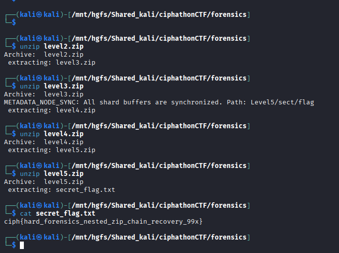

# Archive Node #99X — Recursive Container Analysis

## Category: Forensics

## Challenge Description
A zip file containing multiple nested zip archives.

## Solution

A zip file was given. We unzipped it multiple times as it had multiple nested zip files inside. After extracting all the layers, we finally got a text file which contained the flag.



## Flag
```
ciph{hard_forensics_nested_zip_chain_recovery_99x}
```
