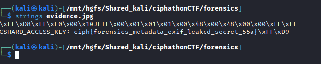

# Artifact Node #55A

## Category: Forensics

## Challenge Description
A corrupted image file was provided for analysis.

## Solution

A corrupted image was provided. Inside its strings, there was the flag hidden in the metadata.



## Flag
```
ciph{forensics_metadata_exif_leaked_secret_55a}
```
