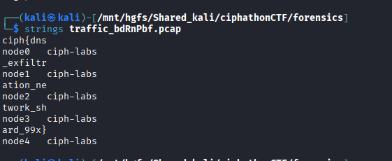

# DNS Node — Covert Channel Reconstruction

## Category: Forensics

## Challenge Description
A network capture file containing DNS traffic with exfiltrated data.

## Solution

We extracted many strings using the `strings` command, then joined them together to reconstruct the flag.



## Flag
```
ciph{dns_exfiltration_network_shard_99x}
```
