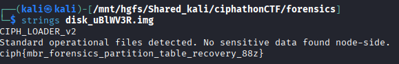

# Disk Node — Hidden Volume Reconstruction

## Category: Forensics

## Challenge Description
A disk image file was provided containing hidden data.

## Solution

A disk image was given. There were some strings in it, and one of them was the flag.



## Flag
```
ciph{mbr_forensics_partition_table_recovery_88z}
```
