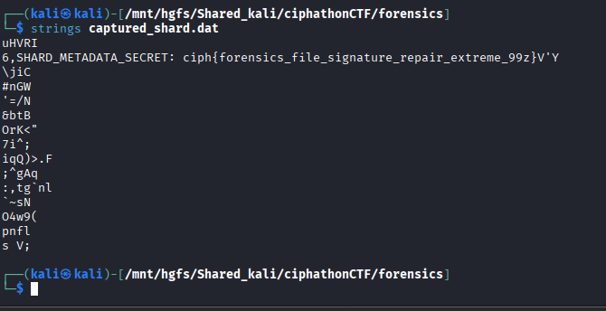

# Forensic Node #337 — Fragmented Container Recovery

## Category: Forensics

## Challenge Description
A corrupted/fragmented container file was provided for analysis.

## Solution

We used `strings` command to find the flag inside the file. It listed all the readable strings in the file, and one of them was the flag.



## Flag
```
ciph{forensics_file_signature_repair_extreme_99z}
```
