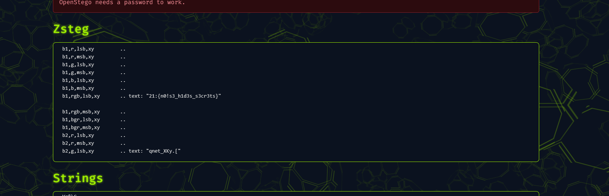

# Hidden in the Noise

## Category: Forensics

## Challenge Description
An image file was provided with hidden data.

## Solution

An image was given. We used `zsteg` on [Aperisolve](https://www.aperisolve.com/) to analyze the image for steganographic content. The flag was found embedded in the image.



## Flag
```
ciph{n0!s3_h1d3s_s3cr3ts}
```
