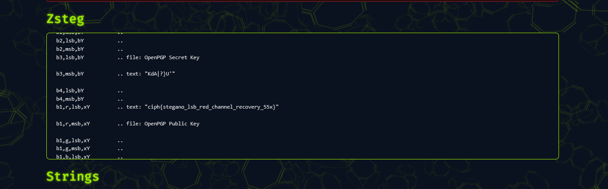

# Image Node — Signal Reconstruction

## Category: Forensics

## Challenge Description
An image file containing hidden steganographic data.

## Solution

An image was given. Using `zsteg` on [Aperisolve](https://www.aperisolve.com/), we could see the flag hidden in the image data.



## Flag
```
ciph{stegano_lsb_red_channel_recovery_55x}
```
