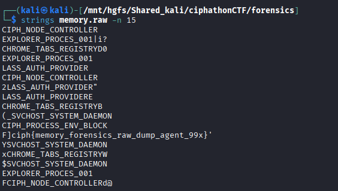

# Memory Node — Volatile Context Extraction

## Category: Forensics

## Challenge Description
A memory dump was provided for forensic analysis.

## Solution

In this challenge, a memory dump was given. We analyzed it to extract the flag.



## Flag
```
ciph{memory_forensics_raw_dump_agent_99x}
```
