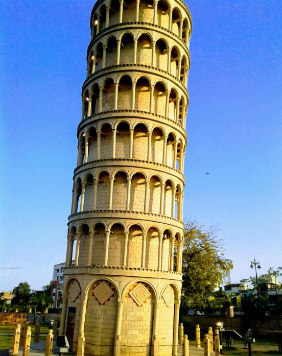
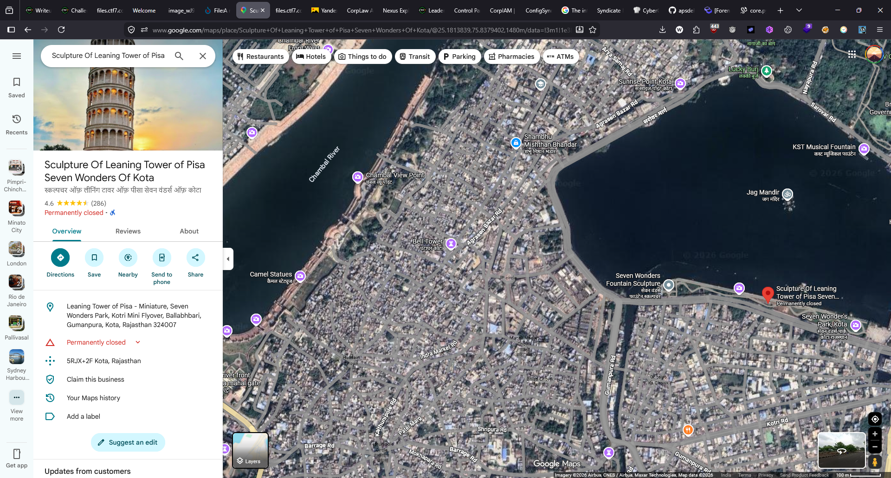

# Beside the Monument

## Category: OSINT

## Challenge Description
An image was given and we were asked to find the name of the river flowing beside the location.

## Solution

An image of a monument was provided:



By doing reverse image searching, we identified the location:


Then we found the name of the river from Google Maps:



## Flag
```
ciph{CHAMBAL}
```
