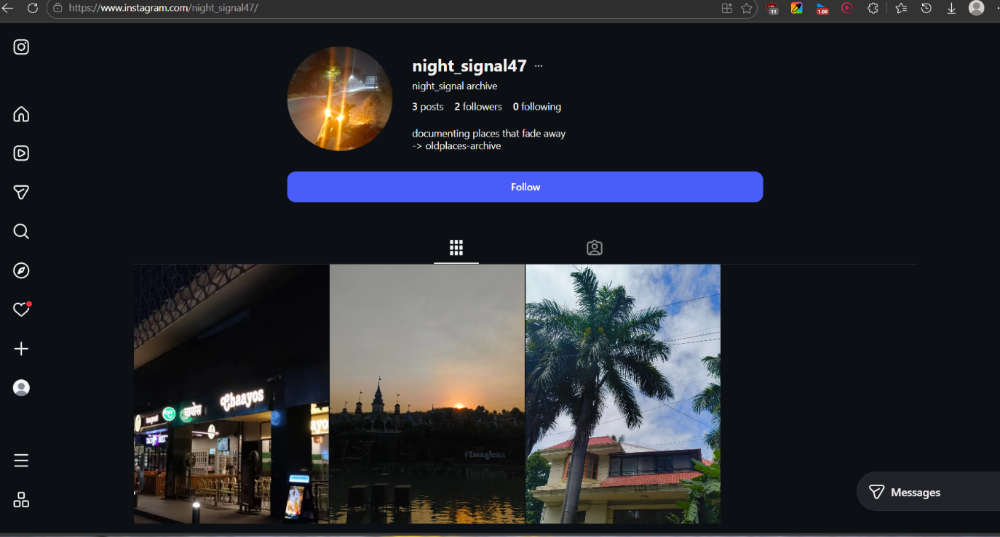
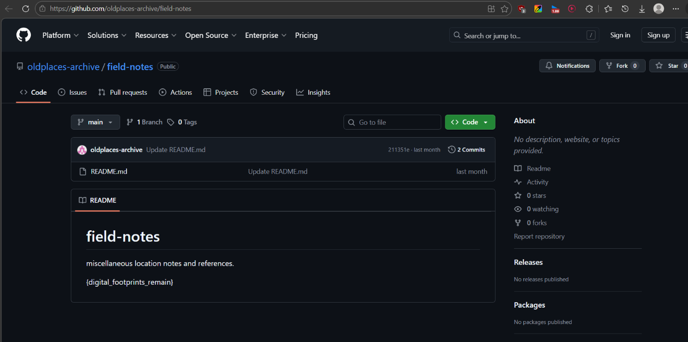

# Digital Footprints

## Category: OSINT

## Challenge Description
A username was given to trace someone's digital presence.

## Solution

In this challenge, a username was given to us: `night_signal47`

By doing Google dorking and OSINT, we found the user's Instagram account:



In their bio, another username was mentioned. After doing more Google dorking and OSINT, we found their GitHub account. In one of the repositories, we found the flag:



## Flag
```
ciph{difital_footprints_remain}
```
