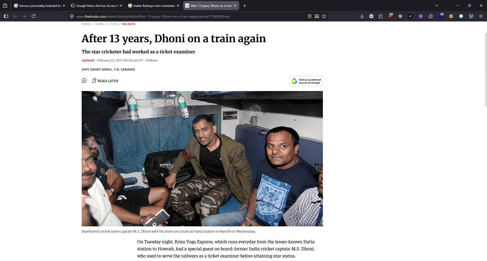
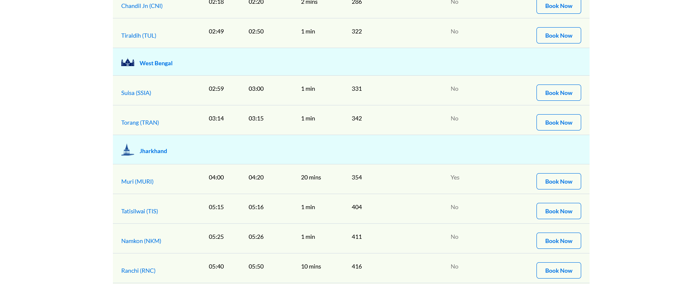

# The Quiet Journey

## Category: OSINT

## Challenge Description
> Indian Railways moves millions every day, yet some journeys quietly slip into the news for reasons unrelated to delays or accidents.
>
> In late 2017, a nationally recognisable figure chose a public mode of transport after more than a decade - not for necessity, but preference.
>
> The journey took place overnight, beginning from a state capital in eastern India and ending the following morning in one of the country's busiest railway terminals. In the middle of a journey he wanted to take a halt at a station whose English name had the least number of alphabets among all the scheduled halts for that train. (without the words like cantonment, junction, station). You need to identify the station and the full name of the person and report it in the format {station_person}

## Solution

We used Google advanced search with many filters to find the relevant information.

**Busiest railway terminal:** Howrah Junction


From the news articles, we found the famous person was **M.S. Dhoni**:



The train was **18615 - Kriya Yoga Express**. Checking its route:



We found that **Muri** station has the least number of alphabets among all the scheduled halts for that train (4 letters).

## Flag
```
ciph{MURI_MAHENDRA_SINGH_DHONI}
```
