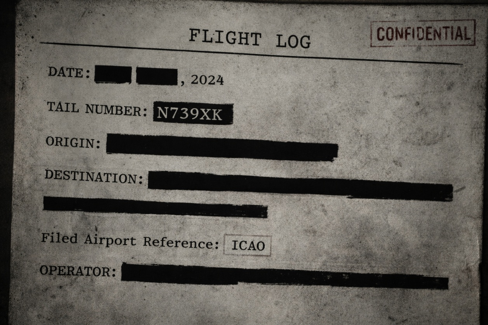
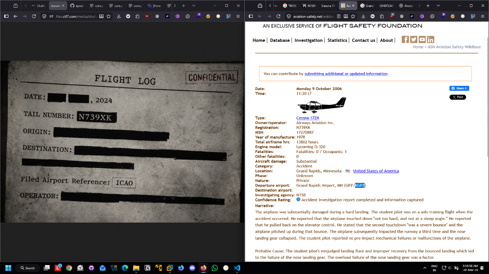

# The Redacted Ledger

## Category: OSINT

## Challenge Description
A redacted flight log image about some incident was provided.

## Solution

We were given a redacted image of a flight log about some incident.



We had to find the filed Airport reference (ICAO code). By searching the tail number of the flight, we stumbled upon a webpage with information about the incident, which also revealed the ICAO code of the relevant airport.



## Flag
```
Ciph{KGPZ}
```
