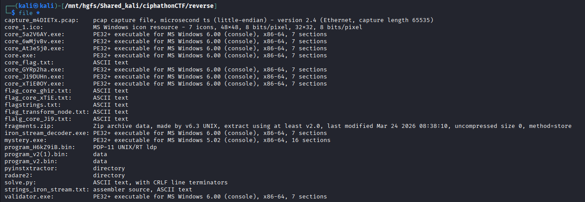
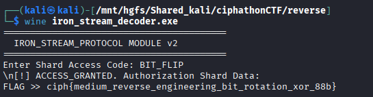

# Bitstream Node

## Category: Reverse Engineering

## Challenge Description
An executable implementing a bitstream protocol with rotation and XOR encryption.

## Solution

We were given an executable. We checked it using `file` command and found it was a PE32+ executable for MS Windows.



We used [pyinstxtractor](https://github.com/extremecoders-re/pyinstxtractor) to decompile the executable.

Among the many `.pyc` files extracted, there was `iron_stream_decoder.pyc`. We used [pylingual.io](https://pylingual.io/) to decompile the `.pyc` file and got this code:

```python
# Decompiled with PyLingual (https://pylingual.io)
# Internal filename: 'iron_stream_decoder.py'
# Bytecode version: 3.14rc3 (3627)
# Source timestamp: 1970-01-01 00:00:00 UTC (0)

import os
import sys
import time

def rotr(n, d, width=8):
    return (n >> d | n << width - d) & (1 << width) - 1

def main():
    print('=========================================')
    print('  IRON_STREAM_PROTOCOL MODULE v2')
    print('=========================================')
    blob = [9, 89, 145, 81, 201, 121, 57, 49, 57, 57, 129, 57, 41, 232, 129, 57, 1, 177, 105, 232, 129, 25, 209, 211, 1, 249, ...]
    key = input('Enter Shard Access Code: ').strip()
    if key == 'BIT_FLIP':
        print('\n[!] ACCESS_GRANTED. Authorization Shard Data:')
        res = ''.join((chr(rotr(b, 3) ^ 66) for b in blob))
        print(f'FLAG >> {res}')
    else:
        print('\n[!] ACCESS_DENIED. Protocol Shard Key Error.')

if __name__ == '__main__':
    main()
```

The decryption applies a right rotation by 3 bits followed by XOR with 66 (`0x42`). After analysis, we found the key `BIT_FLIP` and used it to decrypt the flag.



## Flag
```
ciph{medium_reverse_engineering_bit_rotation_xor_88b}
```
