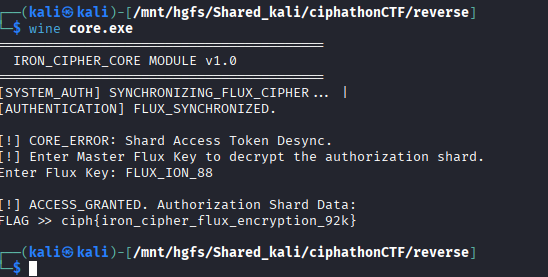

# Flux Node — State Machine Validator

## Category: Reverse Engineering

## Challenge Description
An executable file was provided that implements a state machine validator.

## Solution

We were given an executable. We checked it using `file` command and found it was a PE32+ executable for MS Windows.


We used [pyinstxtractor](https://github.com/extremecoders-re/pyinstxtractor) to decompile the executable.

Among the many `.pyc` files extracted, there was `code.pyc`. We used [pylingual.io](https://pylingual.io/) to decompile the `.pyc` file and got this code:

```python
# Decompiled with PyLingual (https://pylingual.io)
# Internal filename: 'core.py'
# Bytecode version: 3.14rc3 (3627)
# Source timestamp: 1970-01-01 00:00:00 UTC (0)

import os
import sys

def get_pi_digits():
    return '3141592653589793238462643383279502884197169399375105820974944592307816406286208998628034825342117067'

def main():
    print('=========================================')
    print('  IRON_PI_CORE HUB v10.0 (Extreme)')
    print('=========================================')
    blob = [96, 104, 116, 105, 126, 108, 122, 114, 119, 102, 109, 86, 117, 103, 113, 123, 97, 89, 99, 106, 112, 110, 86, ...]
    key = input('Enter Shard Key: ').strip()
    if key == 'POS_XOR':
        pi = get_pi_digits()
        res = ''.join((chr(blob[i] ^ int(pi[i])) for i in range(len(blob))))
        print('\n[!] NODE_AUTHORIZED. Authorization Shard Data:')
        print(f'FLAG >> {res}')
    else:
        print('\n[!] ACCESS_DENIED. Protocol mismatch.')

if __name__ == '__main__':
    main()
```

After reverse engineering, we found the key `POS_XOR` and used it to decrypt the flag by XOR-ing the blob values with the digits of Pi.



## Flag
```
ciph{iron_cipher_flux_encryption_92k}
```
