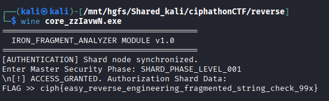

# Fragment Node #100 — Key Reassembly

## Category: Reverse Engineering

## Challenge Description
An executable with a fragmented key that needs to be reassembled.

## Solution

We were given an executable. We checked it using `file` command and found it was a PE32+ executable for MS Windows.


We used [pyinstxtractor](https://github.com/extremecoders-re/pyinstxtractor) to decompile the executable.

Among the many `.pyc` files extracted, there was `core.pyc`. We used [pylingual.io](https://pylingual.io/) to decompile the `.pyc` file and got this code:

```python
# Decompiled with PyLingual (https://pylingual.io)
# Internal filename: 'core.py'
# Bytecode version: 3.14rc3 (3627)
# Source timestamp: 1970-01-01 00:00:00 UTC (0)

import os
import sys

def main():
    print('=========================================')
    print('  IRON_FRAGMENT_ANALYZER MODULE v1.0')
    print('=========================================')
    f1 = 'SHARD_PHASE_'
    f2 = 'LEVEL_'
    f3 = '001'
    print('[AUTHENTICATION] Shard node synchronized.')
    key = input('Enter Master Security Phase: ').strip()
    if key == f1 + f2 + f3:
        print('\n[!] ACCESS_GRANTED. Authorization Shard Data:')
        print('FLAG >> ciph{easy_reverse_engineering_fragmented_string_check_99x}')
    else:
        print('\n[!] ACCESS_DENIED. Protocol Shard Desync Error.')
        print('Hint: Our node key is fragmented into three kernel variables.')

if __name__ == '__main__':
    main()
```

The key was fragmented into three variables: `f1 = 'SHARD_PHASE_'`, `f2 = 'LEVEL_'`, `f3 = '001'`. Concatenating them gives the key: `SHARD_PHASE_LEVEL_001`.

The flag was printed directly in the source code upon successful authentication.



## Flag
```
ciph{easy_reverse_engineering_fragmented_string_check_99x}
```
