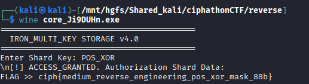

# Mask Node — Positional Validator

## Category: Reverse Engineering

## Challenge Description
An executable implementing a positional XOR mask for encryption.

## Solution

We were given an executable. We checked it using `file` command and found it was a PE32+ executable for MS Windows.


We used [pyinstxtractor](https://github.com/extremecoders-re/pyinstxtractor) to decompile the executable.

Among the many `.pyc` files extracted, there was `core.pyc`. We used [pylingual.io](https://pylingual.io/) to decompile the `.pyc` file and got this code:

```python
# Decompiled with PyLingual (https://pylingual.io)
# Internal filename: 'core.py'
# Bytecode version: 3.14rc3 (3627)
# Source timestamp: 1970-01-01 00:00:00 UTC (0)

import os
import sys
import time

def main():
    print('=========================================')
    print('  IRON_MULTI_KEY STORAGE v4.0')
    print('=========================================')
    blob = [201, 194, 220, 197, 213, 194, 219, 198, 217, 234, 196, 210, 206, 200, 200, 226, 209, 167, 168, 172, 166, 161, 183, 175, 169, 150, 186, 164, 191, 146, 182, 160, 162, 142, 178, 190, 137, 239, 224, 187, ...]
    key = input('Enter Shard Key: ').strip()
    if key == 'POS_XOR':
        print('\n[!] ACCESS_GRANTED. Authorization Shard Data:')
        res = ''.join((chr(b ^ (170 + i) % 256) for i, b in enumerate(blob)))
        print(f'FLAG >> {res}')
    else:
        print('\n[!] ACCESS_DENIED. Protocol mismatch.')

if __name__ == '__main__':
    main()
```

The decryption uses positional XOR with `(170 + index) % 256`. After analysis, we found the key `POS_XOR` and used it to decrypt the flag.



## Flag
```
ciph{medium_reverse_engineering_pos_xor_mask_88b}
```
