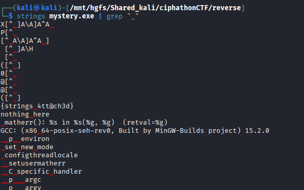

# Strings

## Category: Reverse Engineering

## Challenge Description
An executable file was provided.

## Solution

As the name suggests, we used the `strings` command on the given executable to extract all readable strings, and the flag was found directly in the output.



## Flag
```
ciph{str1ngs_4tt@ch3d}
```
