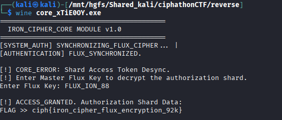

# Temporal Node #777 — Sync Validator

## Category: Reverse Engineering

## Challenge Description
An executable implementing a Linear Congruential Generator (LCG) based stream cipher.

## Solution

We were given an executable. We checked it using `file` command and found it was a PE32+ executable for MS Windows.


We used [pyinstxtractor](https://github.com/extremecoders-re/pyinstxtractor) to decompile the executable.

Among the many `.pyc` files extracted, there was `core.pyc`. We used [pylingual.io](https://pylingual.io/) to decompile the `.pyc` file and got this code:

```python
# Decompiled with PyLingual (https://pylingual.io)
# Internal filename: 'core.py'
# Bytecode version: 3.14rc3 (3627)
# Source timestamp: 1970-01-01 00:00:00 UTC (0)

import sys
import time

def matrix_pulse():
    for i in range(5):
        print(f'\r[SYSTEM_AUTH] SYNCHRONIZING_FLUX_CIPHER... {"|/-\\"[i % 4]}', end='', flush=True)
        time.sleep(0.1)
    print('\n[AUTHENTICATION] FLUX_SYNCHRONIZED.')

def main():
    print('=========================================')
    print('  IRON_CIPHER_CORE MODULE v1.0')
    print('=========================================')
    blob = [14, 40, 121, 80, 214, 148, 57, 55, 95, 169, 78, 86, 42, 49, 3, 180, 244, 248, 29, 33, 79, 219, 177, 46, 168, 162, 84, 153, 175, 172, 110, 249, 114, 91, 118, 123, 58, ...]
    matrix_pulse()
    print('\n[!] CORE_ERROR: Shard Access Token Desync.')
    print('[!] Enter Master Flux Key to decrypt the authorization shard.')
    key = input('Enter Flux Key: ').strip()
    if key == 'FLUX_ION_88':
        print('\n[!] ACCESS_GRANTED. Authorization Shard Data:')
        state = 4919
        res = []
        for b in blob:
            state = state * 1103515245 + 12345 & 4294967295
            k = state >> 16 & 255
            res.append(chr(b ^ k))
        print(f'FLAG >> {"".join(res)}')
    else:
        print('\n[!] ACCESS_DENIED. Kernal Flux De-authorization.')

if __name__ == '__main__':
    main()
```

The decryption uses an LCG (Linear Congruential Generator) with parameters `a=1103515245`, `c=12345`, `m=2^32`, and seed `4919` to generate a keystream, then XORs each blob byte with the corresponding keystream byte. After analysis, we found the key `FLUX_ION_88`.



## Flag
```
ciph{iron_cipher_flux_encryption_92k}
```
