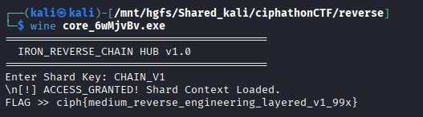

# Transform Node — Layered Validator

## Category: Reverse Engineering

## Challenge Description
An executable implementing layered transformations (reverse, XOR, base64) for encryption.

## Solution

We were given an executable. We checked it using `file` command and found it was a PE32+ executable for MS Windows.


We used [pyinstxtractor](https://github.com/extremecoders-re/pyinstxtractor) to decompile the executable.

Among the many `.pyc` files extracted, there was `core.pyc`. We used [pylingual.io](https://pylingual.io/) to decompile the `.pyc` file and got this code:

```python
# Decompiled with PyLingual (https://pylingual.io)
# Internal filename: 'core.py'
# Bytecode version: 3.14rc3 (3627)
# Source timestamp: 1970-01-01 00:00:00 UTC (0)

import base64
import os
import sys

def main():
    print('=========================================')
    print('  IRON_REVERSE_CHAIN HUB v1.0')
    print('=========================================')
    blob = [14, 3, 123, 86, 6, 88, 73, 107, 75, 106, 0, 101, 94, 80, 95, 101, 94, 80, 95, 64, 10, 101, 2, 105, 70, 81, 67, 87, 105, 70, 81, 67, 87, 121, 1, 85, 100, 97, 71, 71, 82, 68, 68, 68, 68, 68, 68]
    key = input('Enter Shard Key: ').strip()
    if key == 'CHAIN_V1':
        print('\n[!] ACCESS_GRANTED! Shard Context Loaded.')
        rev = bytes(blob[::-1])
        xor = bytes([b ^ 51 for b in rev])
        res = base64.b64decode(xor).decode('utf-8')
        print(f'FLAG >> {res}')
    else:
        print('\n[!] ACCESS_DENIED. Protocol Shard Desync Error.')

if __name__ == '__main__':
    main()
```

The decryption pipeline: **Reverse the blob → XOR each byte with 51 → Base64 decode**. After analysis, we found the key `CHAIN_V1` and used it to decrypt the flag.



## Flag
```
ciph{medium_reverse_engineering_layered_v1_99x}
```
