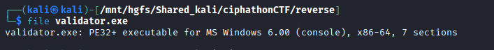

# XOR Shard — Validation Node

## Category: Reverse Engineering

## Challenge Description
An executable file was provided that validates a shard authorization token.

## Solution

We were given an executable. We checked it using `file` command and found it was a PE32+ executable for MS Windows.

We used [pyinstxtractor](https://github.com/extremecoders-re/pyinstxtractor) to decompile the executable.



Among the many `.pyc` files extracted, there was `validator.pyc`. We used [pylingual.io](https://pylingual.io/) to decompile the `.pyc` file and got this code:

```python
# Decompiled with PyLingual (https://pylingual.io)
# Internal filename: 'validator.py'
# Bytecode version: 3.14rc3 (3627)
# Source timestamp: 1970-01-01 00:00:00 UTC (0)

import sys
import time

def matrix_effect():
    for i in range(10):
        print(f'\r[KERNEL_SYNC] ALIGNING_VAULT_SHARDS... {"." * (i % 4)}', end='', flush=True)
        time.sleep(0.05)
    print('\n[AUTHENTICATION] SYSTEM_READY.')

def decrypt_flag(key):
    secret = [33, 43, 50, 42, 57, 48, 39, 39, 52, 39, 49, 39, 29, 44, 37, 39, 35, 49, 29, 59, 58, 45, 32, 123, 58, 63, ...]
    res = ''.join((chr(b ^ key) for b in secret))
    return res

def verify_token(token):
    p = [18, 118, 17, 17, 21, 114, 16, 6]
    user_p = [ord(c) ^ 66 for c in token]
    return user_p == p

def main():
    print('=========================================')
    print('  CIPH-XOR SHARD VALIDATOR SH-001')
    print('=========================================')
    matrix_effect()
    passcode = input('Enter Shard Authorization Token: ').strip()
    if verify_token(passcode):
        print('\n[!] ACCESS_GRANTED. Authorization Shard Flag:')
        print(f'FLAG >> {decrypt_flag(66)}')
    else:
        print('\n[!] ACCESS_DENIED. Kernal Protocol Error.')
        print('Note: All shards are encrypted with 0x42 (Master Protocol Cipher).')

if __name__ == '__main__':
    main()
```

After reverse engineering the code, we found that the key is `0x42` (66 in decimal) and used it to XOR-decrypt the flag.

## Flag
```
ciph{reverse_engineering_easy_xor_bypass_99x}
```
